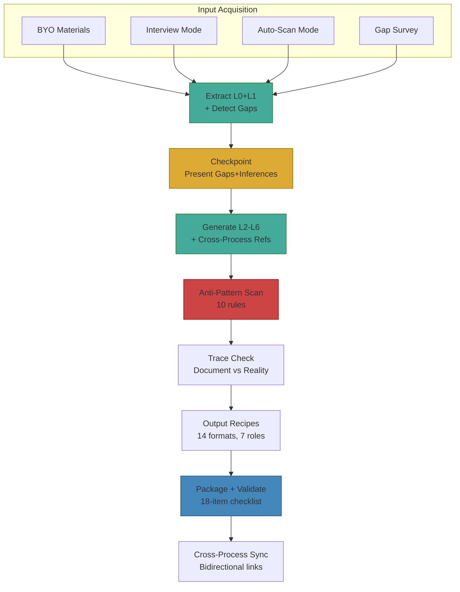

# meta-skill-process-architect

> 🏗️ 把任何业务流程的原始资料变成结构化、多角色、可执行、可维护的流程 Skill。

[](VERSION)
[]()
[](LICENSE)
[]()

---

## 30 秒理解

你有一堆流程资料（SOP 文档、流程图、Wiki 页面、访谈记录、Jira 日志），想变成一套结构化的流程 Skill。这套 Skill 要给 3-7 种角色用（执行者、审计者、新人、管理者……），要能跨平台跑（WorkBuddy / OpenClaw / Claude Code / 独立使用）。

**全行业通用**：L0-L6 框架不绑定任何行业。适用于客服、物流、制造、医疗、金融、保险、教育、IT运维、HR 等任何有多步骤、多角色的业务流程。示例中使用退款流程仅为演示——框架本身不含行业假设。

**这个元技能就是做这件事的。**

它会产出 `process-{name}/` 目录，包含：
- **SKILL.md** — 入口（L0）
- **process-brief.md** — 完整流程定义：9 个子节（L1）
- **foundational-logic.md** — 为什么这样设计（L2）
- **output-recipes.md** — 14 种产出格式，面向不同角色（L3）
- **artifacts-registry.md** — 表单/模板/检查清单索引（L4）
- **visualization-spec.md** — Mermaid 图规范（L5）
- **cases-library.md** — 案例与经验库（L6）

---

## Quick Start

```bash
# 1. 初始化 —— 给流程起个名字，指定原始资料目录
python cli/meta-skill-process-architect.py init \
  --name "Customer Refund" \
  --materials ./my-refund-docs/

# 2. 生成 —— CLI 搭好骨架，内容由 agent 工作流填充（见 SKILL.md）
python cli/meta-skill-process-architect.py generate \
  --output ./process-customer-refund/

# 3. 验证 —— 18 项结构检查 + 10 条反模式扫描
python cli/meta-skill-process-architect.py validate \
  --skill ./process-customer-refund/

# 4. 打包 —— 生成 .tar.gz，可直接导入 WorkBuddy 或 OpenClaw
python cli/meta-skill-process-architect.py package \
  --format workbuddy \
  --skill ./process-customer-refund/
```

> 💡 **只想看一个完整例子？** 打开 `examples/process-employee-it-onboarding/`，里面是一个已经通过全部验证的新员工 IT 账号开通流程 Skill。

---

## Architecture



---

## Documentation Map

| 文件 | 内容 | 给谁看 |
|---|---|---|
| `SKILL.md` | 元技能入口 — 前置条件、Workflow Step 0-8、约束条件、验证清单 | **所有人 first** |
| `references/process-archetype.md` | L0-L6 完整 schema + Gap Handling + 反模式检测 + 生命周期规则 | 想理解"为什么这样设计" |
| `references/role-audience-model.md` | 7 种标准角色 + 5 种角色性质 + recipe→角色映射 | 设计 recipe 时 |
| `references/lifecycle-operations.md` | 版本 bump、TTL 管理、diff-aware 更新、生命周期状态机 | 维护生成的 Skill 时 |
| `references/trace-mode.md` | 文档 vs 现实 drift 分析、步骤分类、健康阈值 | 怀疑文档过时时 |
| `references/cross-process-network.md` | 跨流程引用检测、双向链接同步、网络可视化 | 多个流程互联时 |
| `references/interview-mode.md` | 三方访谈脚本 + 合并算法 + 冲突解决 | 用访谈模式采集时 |
| `references/auto-scan-mode.md` | URL→draft 提取规则（Confluence/Notion/Jira）| 用自动扫描模式时 |
| `references/gap-survey-guide.md` | 按角色分发问卷 | 有信息缺口时 |
| `cli/meta-skill-process-architect.py` | Python CLI 工具（stdlib only）| 命令行操作 |
| `templates/` | 30 个中英双语模板 | 生成 Skill 时自动使用 |
| `examples/process-employee-it-onboarding/` | 完整示例 | 想看成品长什么样 |
| `DESIGN.md` | 精简设计参考（11 ADR + L0-L6 速览） | 理解设计决策 |
| `CONTRIBUTING.md` | 贡献指南 | 想参与开发 |
| `SELF-VALIDATION.md` | v1.2.4 自验证报告（含 G10-G12 自动化检查 + 已知 false positive 清单）| 验证质量标准 |
| `agents/` | 多平台 agent 配置（OpenAI/Claude/WorkBuddy/OpenClaw/Codex） | 部署到特定平台 |

---

## CLI 命令速查

```bash
# 生命周期
process-architect init       --name "..." --materials ./.../
process-architect generate   --output ./process-.../
process-architect validate   --skill ./process-.../
process-architect package    --format workbuddy --skill ./process-.../

# 维护（Phase 3）
process-architect bump       --skill ./process-.../ --type minor "描述变更"
process-architect ttl-check  --skill ./process-.../                  # 单 Skill
process-architect ttl-check  --skills ./dir1,./dir2                  # 批量
process-architect diff-plan  --skill ./process-.../ --since 1.0.0

# 网络（Phase 3）
process-architect network    --skills ./all-processes/               # 全部流程
process-architect network    --skill ./process-.../ --skills-dir ./  # 单流程焦点

# 高级验证（Phase 3）
process-architect validate   --skill ./process-.../ --trace --trace-source flow.csv
process-architect validate   --skill ./process-.../ --coverage
process-architect validate   --skill ./process-.../ --trace --sla-report sla.csv
```

---

## 生成的 Skill 结构

```
process-{name}/
├── SKILL.md                         # L0 — 入口 + 速查表
├── VERSION                          # 语义化版本
├── CHANGELOG.md                     # 变更记录
├── LICENSE                          # MIT
├── agents/openai.yaml
├── references/
│   ├── process-brief.md             # L1 — 触发/输入/角色/步骤/决策/状态机/RACIO/SLA/边界
│   ├── foundational-logic.md        # L2 — 目的/权衡/设计原则/方法论来源
│   ├── output-recipes.md            # L3 — 14 种产出格式
│   ├── artifacts-registry.md        # L4 — 表单/模板/检查清单索引
│   ├── visualization-spec.md        # L5 — 流程图绘制约定
│   └── cases-library.md             # L6 — 案例与经验库
└── assets/
    ├── flowcharts/
    ├── forms/
    └── templates/
```

---

## 版本历史

| 版本 | 日期 | 内容 |
|---|---|---|
| **1.0.0** | 2026-05 | Phase 4 发布 — README 完整化、examples/、自验证、git init |
| **0.9.0** | 2026-05 | Phase 3 — Lifecycle Operations (bump/ttl-check/diff-plan)、Trace Mode、Cross-Process Network |
| **0.5.0** | 2026-05 | Phase 2 — 4 种输入模式、14 种 recipes、L4-L6 模板、30 个双语模板 |
| **0.1.0** | 2026-05 | Phase 1 — L0-L6 框架、6 种核心 recipe、CLI、反模式检测 |

详见 `CHANGELOG.md`。

---

## Canonical Design

本实现源自 `DESIGN.md`（独立发布）和 `../meta-skill-process-architect-plan.md`（monorepo 完整版）。DESIGN.md 是本 Skill 的权威设计参考。任何冲突 → DESIGN.md 为准。

## Platform Compatibility

| 平台 | CLI | Agent | 打包格式 |
|---|---|---|---|
| macOS | ✅ | ✅ | tar.gz |
| Windows | ✅ | ✅ | tar.gz (Python tarfile) |
| Linux | ✅ | ✅ | tar.gz |
| WorkBuddy | — | ✅ | tar.gz (Skills → Import) |
| OpenClaw | — | ✅ | tar.gz (skills install) |
| Claude Code | — | ✅ | `.claude/skills/` |
| OpenAI GPTs | — | ✅ | Knowledge Files |
| Standalone | ✅ | ✅ | Markdown Bundle |

CLI 仅依赖 Python 3.9+ 标准库（pathlib/tarfile/argparse/json/os/re/shutil/subprocess/csv），零外部依赖，开箱即用。YAML 输出为可选功能（需 PyYAML）。

---

## License

MIT — 详见 `LICENSE`。
