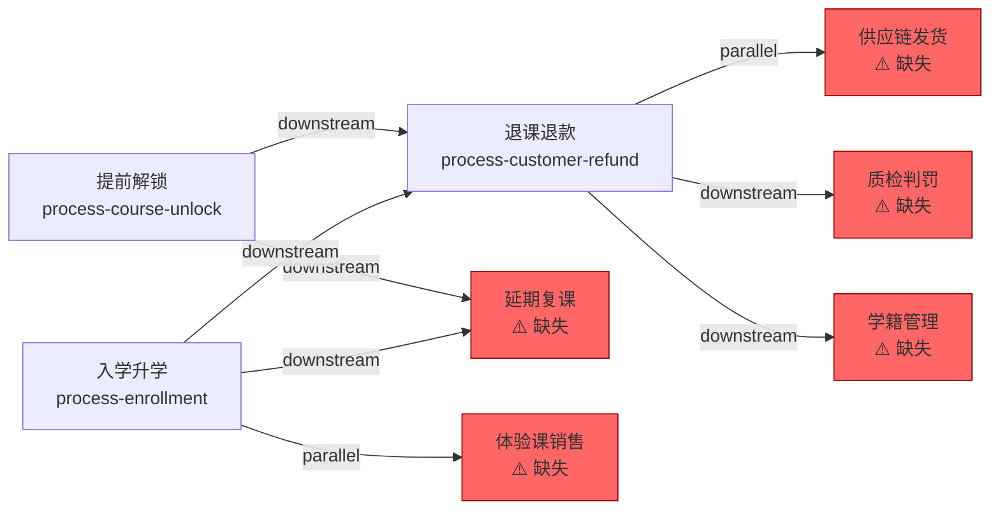

# Cross-Process Network — Multi-Skill Interconnection

> **Phase 3 capability.** When multiple process Skills reference each other via handoff events, the Cross-Process Network makes these references bidirectional, verifiable, and visualizable.
>
> **Industry-agnostic**: The examples below use a customer refund process for illustration, but the same patterns apply to any domain — logistics (shipment → inventory), finance (claim → payout), healthcare (intake → treatment), manufacturing (order → production → QA).

---

## Overview

Individual process Skills are useful in isolation, but real operations involve chains and webs of processes. A refund triggers a supply chain return, which triggers an inventory update. An enrollment triggers a class assignment, which triggers a teacher allocation.

The Cross-Process Network layer:
1. **Detects** cross-process references by parsing L1.9 `out_of_scope` sections
2. **Verifies** that referenced processes exist and handoff events match
3. **Synchronizes** bidirectional links (if A references B, B should reference A)
4. **Visualizes** the network as a Mermaid graph

---

## 1. Reference Types

Process Skills reference each other through L1.9 `out_of_scope` entries:

| Reference Type | Meaning | Example |
|---|---|---|
| `downstream_process` | This process hands off work to another process | Refund → Supply Chain Return |
| `upstream_process` | This process receives work from another process | Enrollment ← Sales Lead Assignment |
| `parallel_process` | Two processes run concurrently, sharing data | Course Unlock ∥ Trial Class Unlock |
| `rule_doc` | This process is governed by rules defined in another | Refund governed by Student Status Policy |

---

## 2. Handoff Event Specification

Each cross-process reference in L1.9 should define a handoff event:

```yaml
out_of_scope:
  - description: "配套实物发货与库存管理"
    reference:
      type: parallel_process
      target: "供应链发货流程"  # or process slug: "process-supply-chain"
    handoff_event:
      from_step: "S3"           # Step in THIS process that triggers handoff
      to_step: "receive_return" # Step in TARGET process that receives handoff
      mechanism: "工单创建"      # How the handoff happens
      sla: "签收7天内可寄回"     # SLA for handoff completion
      failure_recovery: "未发货关闭订单；超期扣除费用"
```

---

## 3. Network Detection Algorithm

### Algorithm: build_network

```
Input:  Directory containing multiple process-* Skill directories
Output: network-map.json + Mermaid visualization

1. SCAN:
   For each process-*/references/process-brief.md:
     - Parse L1.9 "流程外" / "Out of Scope" section
     - Extract all out_of_scope entries with reference.target

2. RESOLVE:
   For each reference:
     - Match reference.target to a directory name (exact or fuzzy)
     - If matched → mark as "resolved"
     - If not matched → mark as "unresolved"

3. DETECT_MISSING_BACKLINKS:
   For each resolved reference (A → B):
     - Check if B's L1.9 references A
     - If not → flag as "missing backlink"

4. GENERATE:
   - Write network-map.json with all nodes and edges
   - Generate Mermaid graph
```

### Fuzzy Matching Rules

Since reference targets may use Chinese names, English names, or slugs:

| Target in L1.9 | Matches |
|---|---|
| `process-customer-refund` | Directory `process-customer-refund/` |
| `退课退款流程` | Directory whose SKILL.md title contains "退款" |
| `SP007` | Directory whose process-brief mentions SP007 |
| `供应链发货流程` | Directory whose process-brief mentions "供应链" |

Match confidence: `exact` > `fuzzy_name` > `fuzzy_keyword` > `unresolved`

---

## 4. Network Map Format

```json
{
  "network_name": "中台运营流程网络",
  "generated_at": "2026-05-15",
  "nodes": [
    {
      "id": "process-customer-refund",
      "name": "退课退款流程",
      "version": "1.0.0",
      "edges_out": 3,
      "edges_in": 2
    },
    {
      "id": "process-enrollment",
      "name": "入学升学流程",
      "version": "1.0.0",
      "edges_out": 3,
      "edges_in": 2
    }
  ],
  "edges": [
    {
      "from": "process-customer-refund",
      "to": "process-supply-chain",
      "type": "parallel_process",
      "handoff_step": "S3",
      "resolved": false,
      "note": "供应链发货流程 Skill 未找到"
    },
    {
      "from": "process-course-unlock",
      "to": "process-customer-refund",
      "type": "downstream_process",
      "handoff_step": "S1.A",
      "resolved": true,
      "backlink_exists": false,
      "note": "process-customer-refund 未反向引用 process-course-unlock"
    }
  ],
  "unresolved_refs": [
    "供应链发货流程",
    "质检判罚流程",
    "学籍管理办法总则"
  ],
  "missing_backlinks": [
    "process-customer-refund → process-course-unlock"
  ]
}
```

---

## 5. Network Visualization (Mermaid)

Generated from `network-map.json`:



**Color semantics**:
- 🟢 Green fill → Skill exists, bidirectional link complete
- 🟡 Yellow fill → Skill exists, missing backlink
- 🔴 Red fill → Referenced Skill not found

---

## 6. Bidirectional Sync

When a reference is detected (Process A → Process B), the sync algorithm:

1. **Checks** if Process B's L1.9 already references Process A
2. If **backlink exists**: verify link type matches (if A→B is downstream, B→A should be upstream)
3. If **backlink missing**: generate a suggested `out_of_scope` entry for Process B

### Suggested Backlink Format

```markdown
### 流程外

- **{{PROCESS_A_NAME}}**
  - 引用类型：upstream_process
  - 指向：{{PROCESS_A_SLUG}}
  - 交接：{{HANDOFF_FROM_STEP}} → {{HANDOFF_TO_STEP}}
  - 交接 SLA：{{HANDOFF_SLA}}
  <!-- 自动生成 — 请验证准确性 -->
```

---

## 7. Network Health Metrics

| Metric | Healthy | Warning | Critical |
|---|---|---|---|
| Unresolved references | 0% | 1-25% | >25% |
| Missing backlinks | 0% | 1-25% | >25% |
| Orphan nodes (no edges) | 0 | 1 | >1 |
| Circular dependencies | 0 | 1 | >1 |

**Orphan node**: A process Skill with zero incoming and zero outgoing references. Indicates either: the process is truly standalone, or cross-process references are missing from L1.9.

**Circular dependency**: A → B → A (bidirectional handoff). Common and acceptable if properly documented with clear SLAs on both sides.

---

## 8. CLI Integration

```bash
# Build network from all Skills in a directory
process-architect network --skills ./_e2e-test/

# Build network for a single Skill + its references
process-architect network --skill ./process-customer-refund/ --skills-dir ./_e2e-test/

# Output to file
process-architect network --skills ./_e2e-test/ --output network-map.json

# Sync bidirectional links (with confirmation)
process-architect network --skills ./_e2e-test/ --sync
```

---

## 9. Integration with Other Phases

| Phase | Integration |
|---|---|
| **Phase 3 (Lifecycle)** | `network` detects new/changed handoffs → triggers `diff-plan` on affected Skills |
| **Phase 3 (Trace)** | Trace drift in one process may cascade — `network` identifies downstream processes to also check |
| **Phase 4 (Publish)** | Network map included in README as architecture diagram |

---

## 10. Limitations & Phase 4 Roadmap

| Limitation | Phase 3 Approach | Phase 4 Plan |
|---|---|---|
| Skills must be in same directory | `--skills-dir` scans one directory | Cross-directory scanning |
| Fuzzy matching is best-effort | Keyword matching in skill names | NLP-based semantic matching |
| No version compatibility check | Manual review of handoff SLAs | Version-aware handoff compatibility |
| Mermaid output only | CLI prints Mermaid code | Auto-render to SVG/PNG |

---

## 11. Quick Reference

```bash
# Scan and visualize network
process-architect network --skills ./skills/

# With sync suggestion
process-architect network --skills ./skills/ --sync

# Single-skill focus
process-architect network --skill ./process-customer-refund/ --skills-dir ./skills/
```
